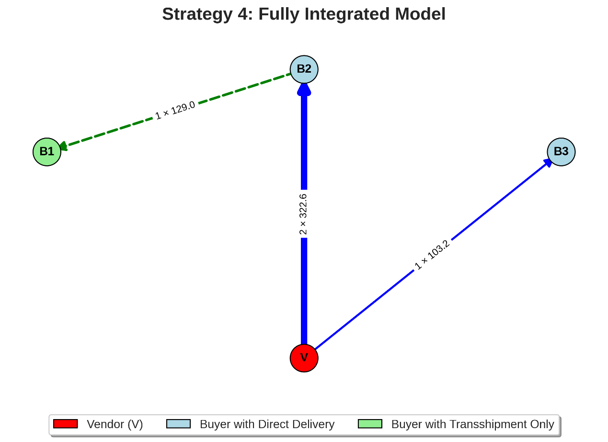
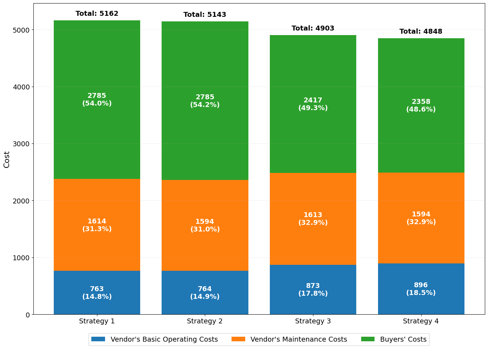

# Python Supply Chain Optimization System: Integrating VMI-CS with Predictive Maintenance

   

## 📖 Project Overview

This project implements an advanced **Inventory Decision Support System** designed for Industry 4.0 environments. It addresses the NP-hard problem of coordinating **Vendor-Managed Inventory (VMI)**, **Consignment Stock (CS)**, and **Predictive Maintenance (PdM)** in a single-vendor multi-buyer supply chain.

By utilizing a **Three-Level Nested Optimization Algorithm**, the system optimizes both continuous variables (maintenance effort, cycle time) and discrete variables (logistics network configuration) simultaneously.

### 🚀 Key Features

* **🧬 Genetic Algorithm (GA):** Optimization of discrete logistics decisions (delivery frequencies, transshipment routes).
* **📉 Nested Nonlinear Optimization:** Integration of **Golden Section Search** and **SLSQP** to solve for optimal maintenance and inventory parameters.
* **🧩 Object-Oriented Design (OOP):** Modularized Python architecture (`main.py`) ensuring scalability and maintainability.
* **📊 Comprehensive Analysis:** Detailed sensitivity analysis (`.ipynb`) evaluating parameter robustness.

---

## 📊 Visualizations & Results

### 1. Optimized Logistics Network

The algorithm dynamically reconfigures the supply chain network. Green nodes indicate buyers whose demand is satisfied purely through lateral transshipment, reducing total setup costs.



### 2. Cost Structure Analysis
Analysis of cost components across different strategies. The integrated model (Strategy 4) demonstrates a balanced cost distribution while achieving the lowest total cost.



### 3. Sensitivity Analysis (3D Surface)

We analyzed the joint effect of **Baseline Failure Rate ($\gamma$)** and **Maintenance Efficiency ($\eta$)** on Total Cost. The result provides a clear decision boundary for investing in predictive maintenance.


> *For full interactive charts and detailed analysis, please check the [Sensitivity_Analysis.ipynb](Sensitivity_Analysis.ipynb).*

---

## 💡 Business Impact (Key Findings)

Based on numerical simulation of a 3-buyer supply chain case:

* **Total Cost Reduction:** Achieved a **6.1%** reduction compared to traditional VMI-CS models.
* **Synergistic Effect:** Quantified a **0.7%** extra benefit from coupling PdM with Transshipment strategies.
* **Reliability:** Significantly reduced system failure rates by optimizing maintenance investment levels based on cost ratios.

---

## 🛠️ Installation & Usage

### Prerequisites

Install the required Python packages using `requirements.txt`:

```bash
pip install -r requirements.txt
```

### 1. Run the Core Optimization Model
   To execute the Genetic Algorithm and generate the optimal network configuration:

```bash
python main.py
```

### 2. Run Sensitivity Analysis
   To explore different parameter scenarios (e.g., cost ratios, capacity constraints), open the Jupyter Notebook:

```bash
jupyter lab Sensitivity_Analysis.ipynb
```

## 📂 File Structure

```text
├── main.py                     # Core Source Code (OOP, GA, Nested Optimization)
├── Sensitivity_Analysis.ipynb  # Data Analysis Report & Visualization
├── requirements.txt            # Dependency list
├── README.md                   # Project Documentation
├── network_plot.png
├── cost_structure.png               
└── sensitivity_3d.png                   
```

## 👨‍💻 Author

**YU-XIANG HUANG**

* M.S. in Transportation Science, National Taiwan Ocean University
* **Skills:** Python, Operations Research, Algorithm Design, Supply Chain Management.
* **Contact:** asd1083004@gmail.com

> **Note:** This repository is a research prototype implementing the algorithms described in my Master's Thesis.


